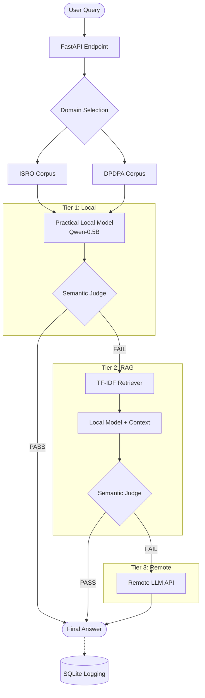
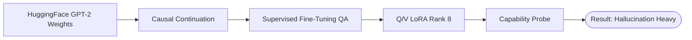

# EdgeCascade Architecture

EdgeCascade routes queries through an escalating pipeline to balance inference cost, latency, and answer quality.

## System Pipeline

## Historical Custom Component (Deprecated)

During early R&D, we attempted to train a tiny 124M parameter GPT-2 model from scratch for Tier 1 to prove extreme cost reduction.

The resulting model was structurally coherent but factually nonsensical on unseen queries. It was replaced by the Qwen-0.5B instruct model for the practical benchmark.
